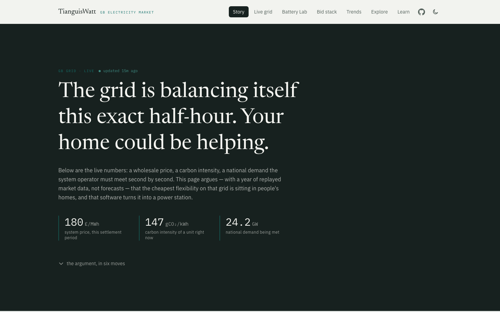
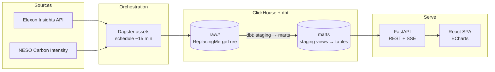

# TianguisWatt

> The GB electricity market, live — and a data-built argument for the power station
> hiding in people's homes. From source APIs to an interactive narrative, updated in
> step with the market's half-hourly settlement periods.

**Live → [tianguiswatt.com](https://tianguiswatt.com)**



TianguisWatt ingests data from the Great Britain power grid every 15 minutes, transforms
it in a **ClickHouse** warehouse with **dbt**, and serves it through a **FastAPI** backend to an
interactive **React** dashboard — an operations-style "control room" plus explorers for the
balancing-mechanism bid stack and time-range trends.

It's a portfolio piece built as a *complete, production-deployed* data platform — ingestion →
warehouse → API → UI → CI/CD — rather than a notebook or a toy. The full design rationale lives
in **[docs/architecture.md](docs/architecture.md)**.

## What it shows

- **The story** — the front page: a six-move narrative from "electricity has a
  different price every thirty minutes" to "a quarter of a million orchestrated home
  batteries is a power station", every claim backed by the project's own backtested
  data — the retail wedge, a one-home battery configurator, a fleet-scale slider drawn
  against the real national demand curve, and what the balancing market actually pays
  for peak flexibility.
- **Live grid** — the control room: generation mix over the last 24h, interconnector
  flows, system frequency, carbon intensity, price, net imbalance, and the balancing
  actions NESO most recently accepted.
- **Explore** — any core metric over a chosen window and granularity (per-settlement-period to
  daily), aggregated server-side in ClickHouse.
- **Bid stack** — the balancing-mechanism offer stack (merit order), cheapest-first, with the
  actions the system operator accepted highlighted.
- **Trends** — how demand, generation, price and carbon *typically* behave: intraday percentile
  bands and a weekday × hour heatmap, from ClickHouse quantile aggregations.
- **Battery Lab** — a home-battery backtest against real Agile tariff rates and carbon
  intensity: arbitrage vs self-consumption vs green charging, a simple timer vs an LP
  optimiser, payback per battery size — plus a methodology tab explaining why the
  numbers come out the way they do.
- **Learn** — a short explainer of how the GB marginal-price market sets a price.

Data updates are pushed to the browser over Server-Sent Events as each cycle lands, and a
freshness badge shows how recent the data is (and turns amber if the pipeline stalls).

## Architecture



Data flows one way: external APIs → Dagster ingestion → ClickHouse `raw` tables (deduplicated by
an ingest version) → dbt staging views → dbt mart tables → FastAPI (REST + Server-Sent Events) →
the React SPA (typed against the API's OpenAPI schema). See
**[docs/architecture.md](docs/architecture.md)** for the detail and the design decisions behind it.

## Tech stack

| Layer | Tools |
|---|---|
| **Data & orchestration** | ClickHouse (OLAP), dbt (transform), Dagster (assets + schedule) |
| **Ingestion** | Python 3.12, httpx, pydantic — Elexon Insights + NESO Carbon Intensity |
| **Backend** | FastAPI, pydantic-settings, clickhouse-connect; OpenAPI-typed |
| **Frontend** | React 19, TypeScript, Vite, Tailwind v4, ECharts, React Query, openapi-fetch |
| **Infra & CI/CD** | Docker Compose, Traefik + Let's Encrypt, GitHub Actions + release-please, GHCR, Hetzner |
| **Tooling** | uv (workspace monorepo), ruff, ty, oxlint, Playwright, bun |

## Repository layout

| Path | Contents |
|---|---|
| `orchestrator/` | Dagster assets + Elexon/NESO ingestion |
| `packages/shared/` | Shared pydantic models + ClickHouse migrations |
| `transform/` | dbt project — staging views, mart tables, data tests |
| `backend/` | FastAPI app (REST + SSE) |
| `frontend/` | React dashboard |
| `compose.yml` | Full stack (dev via `compose.override.yml`, prod via the `prod` profile) |
| `.github/workflows/` | `ci.yml` (PR checks) · `deploy.yml` (tag-triggered deploy) · `release-please.yml` (changelog + releases) |

## Run it locally

Requires [Docker](https://docs.docker.com/get-docker/), [uv](https://docs.astral.sh/uv/), and
[bun](https://bun.sh/).

```bash
docker compose up -d      # postgres, clickhouse, redis, backend, frontend (dev)
./scripts/seed.sh         # migrate + ingest a first batch + build the dbt marts
# open the dashboard → http://localhost:5173
```

See [CONTRIBUTING.md](CONTRIBUTING.md) for the dev workflow (tests, linting, the typed client).

## Deployment

Releases are automated with **release-please**: merging its release PR cuts a `v*` tag, which
triggers GitHub Actions to build the images (GHCR) and deploy to a Hetzner VM behind Traefik with
automatic TLS. Pull-request CI builds every image as a required check. See [DEPLOY.md](DEPLOY.md).

## About the name

**TianguisWatt** blends *tianguis* — the Nahuatl word for an open-air marketplace, still used
across Mexico for the rotating street markets held since pre-Hispanic times — with the *watt*,
the unit of electrical power. Fitting for a project about the electricity **market**, watched in
real time.
