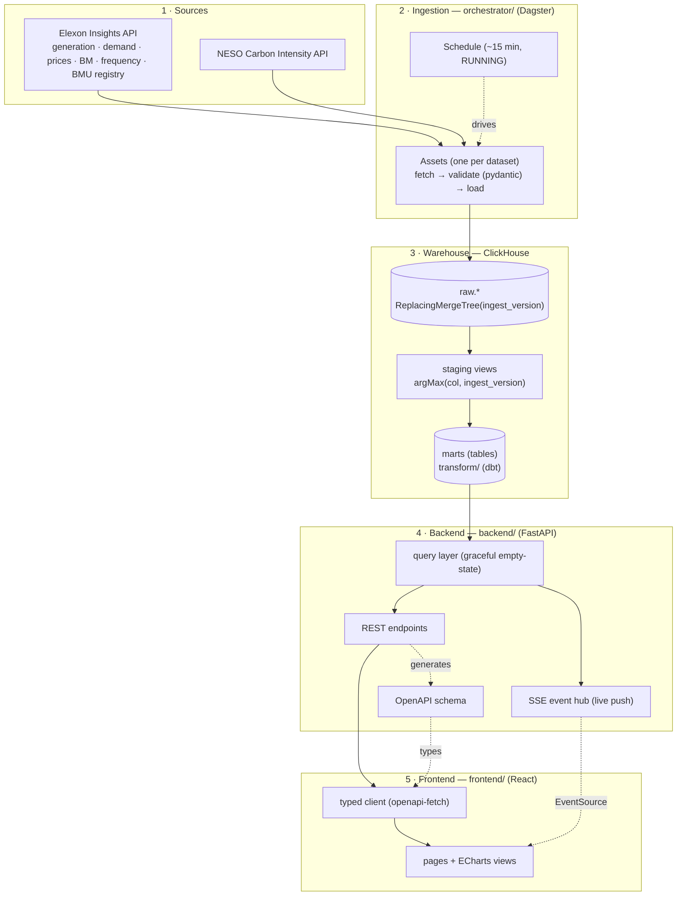
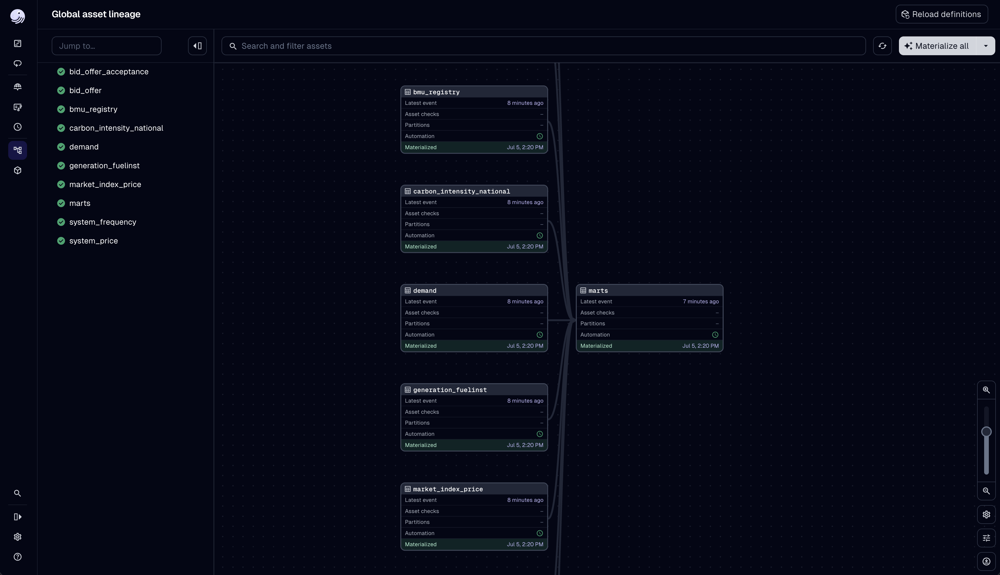

# Architecture

TianguisWatt is a one-way data pipeline: external market APIs are ingested on a schedule, landed
in ClickHouse, transformed with dbt into query-ready marts, and served through a FastAPI backend
to a React dashboard. This document explains each stage and the decisions behind it.

## 1 · Data sources

All data is public. From the **Elexon Insights API** (`data.elexon.co.uk/bmrs/api/v1`):

| Dataset | Feeds |
|---|---|
| `FUELINST` | Instantaneous generation by fuel type (incl. interconnector flows) |
| `demand/outturn` | National + transmission demand |
| `system-prices`, `MID` | Imbalance (cash-out) price + APX/N2EX market index prices |
| `BOD`, `BOALF` | Balancing Mechanism bid-offer pairs + accepted actions |
| `system/frequency` | System frequency (~15s resolution) |
| `reference/bmunits` | BM Unit registry — id → name, fuel, operator |

Plus the **NESO Carbon Intensity API** for national gCO₂/kWh.

## 2 · Ingestion (`orchestrator/`, Dagster)

Each dataset is a **Dagster asset** that fetches from the API, validates the payload into typed
[pydantic models](../packages/shared/src/shared/models.py) (aliasing each API's envelope into a
shared record type), and loads it into a `raw.*` table. A single `ScheduleDefinition` runs the
asset job every ~15 minutes (`default_status=RUNNING`, so it starts on deploy without a manual
toggle).

High-volume datasets are ingested as **rolling windows** rather than full history — e.g. the
balancing bid data (`BOD`) caps queries at 1 hour, so a ~55-minute window is pulled each run;
frequency pulls the last 30 minutes. Re-ingestion overlaps happily (see the dedup pattern below).

## 3 · Warehouse (ClickHouse + dbt)

**Raw layer.** Every `raw.*` table is a `ReplacingMergeTree(ingest_version)`. Each row carries a
monotonic `ingest_version` stamp; on merge, ClickHouse keeps the latest version per sort key. This
makes ingestion **idempotent** — re-fetching an overlapping window (or a revised reading) simply
supersedes the earlier row instead of duplicating it. Migrations live in
[`packages/shared/.../migrations/sql`](../packages/shared/src/shared/migrations/sql).

**Transform layer (dbt).** Two tiers under [`transform/`](../transform):

- **staging** (views) — deduplicate raw without `FINAL` by grouping on the natural key and taking
  `argMax(col, ingest_version)` (the latest value per key).
- **marts** (tables) — the query-ready shapes the API reads. Each has `not_null` tests plus a
  singular grain-uniqueness test.

| Mart | Powers |
|---|---|
| `mart_generation_by_fuel` | Generation mix + the 24h stack |
| `mart_supply_demand` | Demand vs generation |
| `mart_carbon` | Carbon intensity |
| `mart_prices` | System (imbalance) price + APX/N2EX |
| `mart_bid_stack` | Balancing-mechanism offer ladder (merit order) |
| `mart_accepted_actions` | Recent accepted BM actions (joined to the BMU registry for names) |
| `mart_metrics` | Long-format rollup (metric × granularity × bucket) for Explore + Trends |
| `mart_frequency` | System-frequency time series |

## 4 · Backend (`backend/`, FastAPI)

A thin read API over the marts. A small [query helper](../backend/app/queries/util.py) runs SQL
and **degrades to an empty result when a mart doesn't exist yet** — so a fresh deploy (before the
first dbt run) returns `200` with empty data instead of `500`.

- **REST** endpoints for the snapshot, history/time-series, the bid stack, accepted actions, and
  behavioural profiles (intraday/weekly quantiles) — enum params validated via `Literal` types.
- **Server-Sent Events**: an in-process poller checks the latest data timestamp and pushes an
  event when it advances; the SPA subscribes once via `EventSource` and refetches.
- **OpenAPI**: the schema is exported and the frontend generates a fully typed client from it, so
  API/UI types can't drift.

## 5 · Frontend (`frontend/`, React)

React 19 + TypeScript + Vite, styled with a Tailwind v4 design system (editorial serif + IBM Plex,
a fixed palette, per-fuel colours). Data is fetched with React Query through the
**OpenAPI-generated client**; charts are ECharts via a `useECharts` hook (with a `ResizeObserver`
so charts track their container). The UI is responsive down to phones (a hamburger drawer replaces
the inline nav). Pages: the control-room **Home**, **Explore** (time-series), **Bid stack** (merit
order), **Trends** (behavioural analysis — percentile bands + a weekday×hour heatmap), and
**Learn**. A route-level **error boundary** plus a **connection banner** keep failures graceful — a
render bug shows a fallback instead of a blank page, and a backend outage is surfaced, not silent.

## 6 · Deployment & CI/CD

- **Compose** — one `compose.yml` defines the stack; `compose.override.yml` adds dev builds +
  hot-reload, while the `prod` profile adds Traefik + the Dagster services.
- **Traefik** terminates TLS (Let's Encrypt) and routes the apex to the frontend and
  `api.<domain>` to the backend.
- **GitHub Actions** — `ci.yml` runs lint/type/test and builds all images on every PR (a required
  check). Releases are automated by **release-please**, which maintains a changelog + version PR
  from Conventional Commits; merging it cuts a `v*` tag, and that tag runs `deploy.yml`: build +
  push images to GHCR, rsync the compose file to a Hetzner VM, run migrations, and roll the stack.

## Key design decisions

- **ClickHouse for the warehouse** — the workload is append-heavy time-series with wide
  aggregations over time; a columnar OLAP store fits far better than a row store.
- **`ReplacingMergeTree(ingest_version)`** — gives idempotent re-ingestion without a staging/upsert
  dance; overlapping rolling windows and revised readings resolve on merge.
- **dbt raw → staging → marts** — a clear, tested transform boundary; dedup happens once in staging
  (`argMax`) so marts and the API never need `FINAL`.
- **SSE over WebSockets** — updates are one-way (server → client) and low-frequency; SSE is simpler
  and rides plain HTTP.
- **uv workspace monorepo** — the ingestion and API share one pydantic model package, so the record
  shapes can't diverge between writer and reader.
- **OpenAPI-generated client** — end-to-end type safety from the database row to the React prop.
- **Graceful empty-state** — the API is safe to deploy before any data exists, which keeps the
  first deploy and the CI containers simple.
